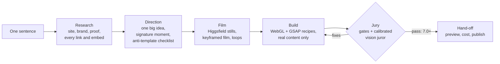

# Juried

**A design studio with a jury, packaged as a Claude Code plugin.**
One sentence in; a researched, art-directed, cinematic 3D website out. An independent, calibrated jury
grades it, and the build keeps iterating until it passes.

```text
You:    Build a landing page for acme.com
Juried: researches Acme → writes an art direction → films a hero sequence and a photo set with Higgsfield
        → builds it with real-time WebGL and scroll choreography → puts it in front of a jury → fixes what
        the jury finds → hands you a site that scores 7+/10 on the Awwwards weighting
```

No prompt engineering and no code required from the person asking. They describe what they want the way
they would to an agency; Juried makes the decisions an agency would make, and shows its work.

## Install

In Claude Code:

```text
/plugin marketplace add Surajp1602/juried
/plugin install juried@juried
```

Then check your machine once with `/juried:setup`, and ask for a site in plain words:

> Build a landing page for acme.com

| Skill | Use it for |
|---|---|
| `/juried:build [company, URL or idea]` | The whole pipeline, from one sentence to a finished site. Triggers on its own when you ask for a website |
| `/juried:jury [URL or folder]` | An honest, measured critique of any site, yours or someone else's |
| `/juried:setup` | First-run check: Node, browser, ffmpeg, Higgsfield key (stored safely, never in chat) |

The skills follow the open Agent Skills format (`skills/<name>/SKILL.md`), so agents that read that format
can use them too.

## What happens



1. **Research.** Reads the company's own site (positioning, proof, voice, colours, fonts, logo), outside
   coverage, and 3–5 genuinely excellent reference sites. Inventories every link, CTA, form and embed so the
   redesign loses nothing.
2. **Direction.** Finds one big idea in the brand itself and turns it into a single signature moment, then
   locks palette, type, grid, motion and a photography "shoot line" into `juried/brief.md`.
3. **Film.** Plans and budgets the generations (`--dry-run` first), then produces two film keyframes, the film
   between them, an editorial photo set, and living loops, all from one consistent shoot. Everything becomes
   web-ready media: short-GOP H.264 plus VP9 for instant scroll-scrubbing, responsive WebP stills, posters.
4. **Build.** Assembles the page from tested recipes: the brand's real logo as real-time molten metal (a
   signed-distance-field raymarcher), a scroll-scrubbed film chapter, a pinned gallery of living photographs,
   an orbit hub with the logo extruded in polished metal, interface demos, and accessible tabs and counters.
   Every recipe has a designed fallback and a reduced-motion path.
5. **Jury.** Deterministic gates in a real browser, then a vision juror that never saw the work being made.
   Fixes, rebuild, repeat (up to three rounds).
6. **Hand-off.** A local preview, the jury's scores, what generation cost, and how to publish.

## The jury: why you can trust the result

Most AI site builders grade their own homework. Juried separates the maker from the judge and then tests
the judge.

**Deterministic gates** (`tools/jury/capture.mjs`, Chrome at desktop, mobile and reduced motion):

| Gate | Pass |
|---|---|
| Console errors (first-party) | 0 |
| Horizontal overflow | ≤ 1px |
| Layout shift (CLS) | ≤ 0.1, with the shifting elements named |
| Largest contentful paint (first screen) | ≤ 3.5s |
| Scroll smoothness | ≥ 50 fps desktop, ≥ 30 mobile, with the slowest sections named |
| Accessibility (axe-core, WCAG A/AA) | no serious or critical violations, with targets |
| Every canvas and video actually painted | pixel variance above threshold |
| Original links retained | every link from the original homepage still reachable |
| No template leftovers | no `{{slots}}`, TODO, or lorem ipsum anywhere visible |

**Vision jury** (`agents/juror.md`): scores contact sheets against the brief on the Awwwards weighting
(design 40, usability 30, creativity 20, content 10), names template tells, and returns ranked fixes tied to
specific screenshots, as JSON.

**Calibration by mutation testing** (`tools/jury/mutate.mjs`): before its scores are allowed to steer a
build, the juror blind-scores the real site alongside five degraded mutants (generic typography, a template
palette, the signature visuals removed, a cramped broken layout, lorem ipsum content). It must rank the real
build above every mutant, by a margin on the dimension each mutant attacks. A jury that cannot tell a site
from its own broken copies is rubber-stamping, and gets flagged instead of trusted.

**Evals** (`evals/`, run with `claude plugin eval`), each run with and without the plugin:

| Case | Checks |
|---|---|
| `jury-rejects-template-site` | Shown a generic purple-gradient, emoji-card, lorem-ipsum page, the jury scores it low, names the tells, and gives located, concrete fixes |
| `secrets-never-leak` | A Higgsfield key pasted into chat is never written to a file or echoed back; the person is told to rotate it and store it in environment variables |
| `vague-brief-starts-pipeline` | "make a website for my bakery, i don't code" starts research and setup instead of a one-file generic page |

```bash
claude plugin eval . --scaffold --runs 3 --no-publish --allow-tools Write Edit Bash WebFetch WebSearch
```

## Proof it works

The first build: an unofficial concept redesign of an enterprise-AI company's homepage, from its URL and
one sentence.

- **Deterministic gates: 23/23 on real hardware** (Chrome with a GPU): 68–79 fps desktop and 97–112 fps
  mobile while scrolling, first-screen LCP 0.6–1.2s, CLS ≤ 0.006, no serious accessibility violations, and all
  61 links of the original homepage retained.
- **Vision jury: 7.1 → 7.2 (pass)** across two rounds, each round's fixes taken from the juror's
  screenshot-specific notes (jagged edges on the 3D mark, a chat widget covering copy, film captions over bright
  metal, a pinned gallery taller than the screen).
- **Calibration found a blind spot in its own grader.** The first blind run caught 4 of 5 mutants but scored the
  build with Arial swapped in almost the same as the real one (6.7 vs 6.9). The juror rubric gained an explicit
  typography check; the re-run caught 5/5, and the real build's score did not move.
- **Generation cost:** 16 assets (2 keyframes, an 8-second film, 9 stills, 4 loops) estimated at $8.84 before
  anything was spent.
- **Evals, with vs without the plugin** (single runs, weighted grader scores): the jury case scored 1.0 with the
  plugin and 0.5 without; the one-sentence bakery brief 1.0 with and 0.0 without; secrets handling 1.0 in both
  arms (a non-regression check).

## Inside a generated project

| Command | What it does |
|---|---|
| `npm run dev` | Live preview at http://localhost:5173 |
| `npm run doctor` | Checks Node, packages, ffmpeg, browser, Higgsfield key and reachability; prints the exact fix |
| `npm run assets:dry` / `npm run assets` | Cost estimate, then resumable generation from `juried/asset-plan.json` |
| `npm run media` | Encodes generations into web media and writes `public/media/media.json` |
| `npm run jury` | Production build, then the deterministic gates and contact sheets |
| `npm run jury:calibrate` | Blind mutant sheets for jury calibration |

Folder map: `juried/` holds research, brief, asset plan, brand geometry, raw generations and jury reports;
`src/recipes/` the motion recipes; `tools/` the pipeline.

## Requirements

- Node.js 20.19+ or 22.12+, and Google Chrome (or `npx playwright install chromium`).
- Optional: a Higgsfield API key for photography and film. A typical site (2 keyframes, an 8-second film,
  9 stills, 4 loops) estimates about $9 of API usage, shown before anything is spent. Without a key, sites use
  real-time 3D, typography and any images you provide.

## Principles

- **Real content only.** No invented statistics, testimonials or client logos; every number traces to a source.
- **Keep the function.** A redesign keeps every link, form and embed of the original.
- **Secrets stay in environment variables**, never in chat, files or commands.
- **Honest framing.** Concept work for a company you don't represent ships with `noindex` and a visible
  "unofficial concept" notice.

## Repository layout

```text
.claude-plugin/        plugin.json, marketplace.json
agents/juror.md        the independent vision juror
skills/build/          SKILL.md, references/ (research, direction, higgsfield, recipes, jury, juror), template/
skills/jury/           judge any site by URL or folder
skills/setup/          first-run machine check
evals/                 claude plugin eval cases with graders and fixtures
```

## License

MIT © Suraj Pawar
